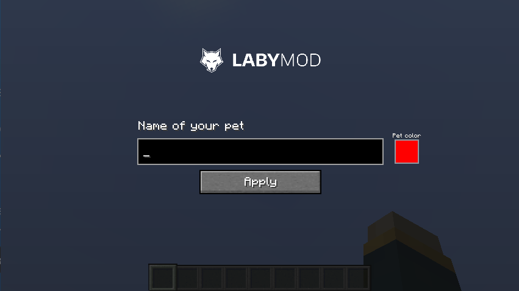

## Widget model to create custom User Interfaces via plugin messages

Click [here](https://docs.labymod.net/pages/server/minecraft/screen/) for more detailed information.

### Available widgets:
- Button
- Text Field
- Label
- Color Picker
- Image

### Example


### Serialize widgets
```java
// Create new screen
JsonObject screen = new JsonObject();
screen.addProperty("id", 42); // Screen id. The client will send this id back on an interaction
screen.addProperty("action", EnumScreenAction.OPEN.ordinal()); // Open the GUI

// Centered anchor
Anchor anchor = new Anchor(50, 50);

// Create widget list
List<Widget> widgets = new ArrayList<>();

// Add button to widget list
widgets.add(new ButtonWidget(0, anchor, -50, 20, "Apply", 100, 20));

// Serialize widgets
screen.add("widgets", WidgetSerialization.toJsonArray(widgets));
```

### Anchor explanation image
